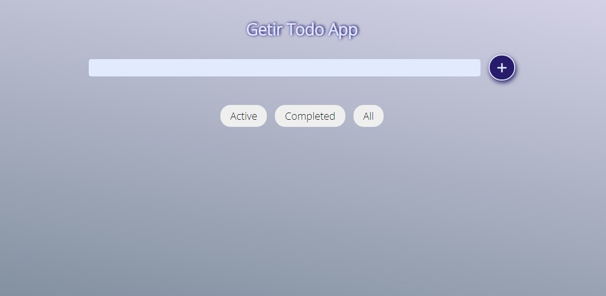
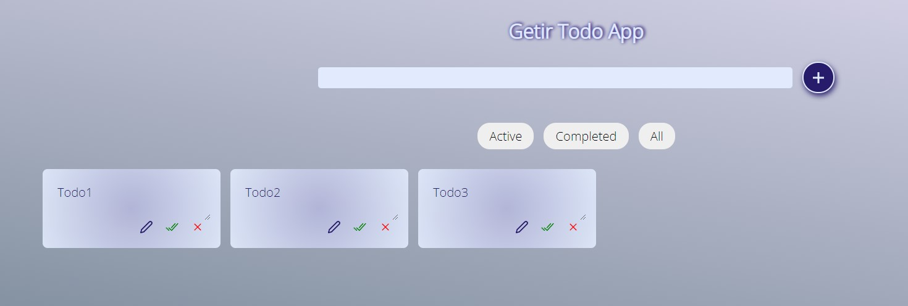

<h2>
    This app, bootstrapped with create-react-app was built as part of the Getir Frontend Exercise.
 </h2>

## What's this app all about?

This is a plain and simple ** To-do App ** that allows you to add tasks to a list, update their titles, delete them, and mark them as complete.

## Libraries used

_[React](https://reactjs.org/)
_[Redux](https://redux.js.org/)

## Preview Images

 
  
 
